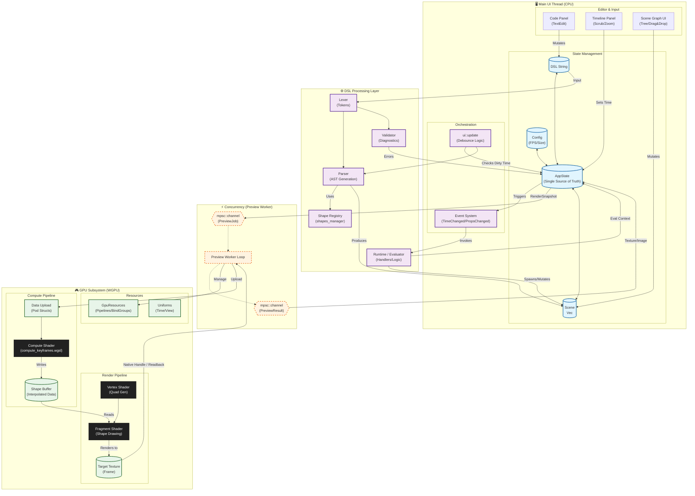

<!--
This document is built incrementally by inspecting the codebase.
Each section will be filled out as we progress through the pipeline described
in the mission notes. Do not generate the entire file at once.
-->
# Motioner Architecture

## 1. System Overview



## 2. Code Editor Architecture

The code editor lives under `src/code_panel` and is responsible for capturing
DSL text from the user, performing lightweight validation, formatting, and
eventually feeding the DSL pipeline described later. The entrypoint is
`code_panel::show` which is invoked from the main UI loop.

### Text storage

The current contents of the DSL editor are stored in
`AppState.dsl_code: String` (see `src/app_state.rs`). This string is mutated
directly by the `egui::TextEdit::multiline` widget inside
`code_panel::show`.

### Input flow and event hooks

1. `show` constructs a custom layouter that calls
   `code_panel::highlighter::highlight_code` for syntax colouring.
2. A `ScrollArea` wraps the `TextEdit`; the code uses
   `ui.make_persistent_id("dsl_text_edit")` to give the widget a stable ID.
3. Before rendering the `TextEdit`, `autocomplete::process_input` is called to
   intercept keystrokes for the autocompletion subsystem. After the
   `TextEdit` returns a `TextEditOutput`, `autocomplete::handle_state_and_render`
   and `utils::handle_color_pickers` are executed to drive their own UI.
4. The gutter (`gutter::render_gutter`) is drawn alongside the editor and is
given the `TextEditOutput` so it can compute line numbers, diagnostics,
and move the cursor on clicks.

### Change detection and debounce

State changes are detected via `TextEditOutput::changed()` inside the
`ScrollArea` closure. When a change occurs:

* `state.autosave.last_code_edit_time` is set to the current frame time (obtained from
  `ui.ctx().input(|i| i.time)`).
* Quick validation is run using `crate::dsl::validate_dsl(&state.dsl_code)`.
  - Results are funneled through `states::autosave::apply_diagnostics` (via
    `state.tick`), which stores the diagnostics, clears the autosave flag on
    error and otherwise prepares the state for a pending save.
* The DSL is normalized with `dsl::generator::normalize_tabs` (tabs instead of
  spaces).

No parsing or scene updates happen at this point; those are handled in
`src/ui.rs` where a second debounce timer is implemented (see below).

### DSL interaction and parsing trigger

The editor itself only calls the DSL layer for validation and formatting as
noted above. Much of the remaining bookkeeping – autosave debounce, repeated
validation and diagnostics handling – lives in `states::autosave` now.  The
public API is a pair of helpers (`apply_diagnostics` and `tick`) that operate
on an `AppState` reference; `state.set_diagnostics` and
`state.autosave_tick` were thin wrappers that have since been removed.  The
`ui` loop still orchestrates when the helpers run. After each frame,
`ui::update` checks `state.autosave.last_code_edit_time` and, if enough wall‑clock time
has passed (120 ms by default), it will:

* Run `dsl::validate_dsl`; any resulting diagnostics are pushed through
  `states::autosave::apply_diagnostics` (called indirectly via `state.tick`) which also inhibits autosave.
* Optionally parse configuration via `dsl::parse_config` to update FPS,
  duration, width/height in `AppState`.
* Parse the full DSL into elements with
  `dsl::parse_dsl_into_elements(&state.dsl_code, state.fps)`. On success it
  replaces `state.scene`, bumps `state.scene_version`, and recomputes
  `state.dsl.event_handlers` via `dsl::extract_event_handlers_structured`.
* When the code panel is active, preview requests are throttled to avoid
  frequent GPU texture swaps; a pending flag is set and cleared after a
  longer idle interval (≈450 ms).

These deferred operations implement the debounce discussed in the mission and
ensure that the DSL pipeline is only invoked when the user has paused typing.
The implementation now resides in `AppState::debounced_parse` (and is
conveniently wrapped by [`AppState::tick`]), keeping the UI code focused on
layout and letting the state object manage the parsing details.  As a result
`ui::update` no longer contains any of the timing logic; it simply calls
`state.tick(now)` once per frame.

### Async / channels

The code panel itself remains synchronous within the egui UI thread. No
`async`/`await` appears in `src/code_panel`, and there are no `mpsc` channels
used to communicate between the editor and the DSL. Coordination with the
rest of the system is via shared mutable `AppState` guarded by egui's single-
threaded UI model.

### Summary of phase 1 findings

* Text is stored in `AppState.dsl_code`.
* Validation and autosave are triggered on every change via
  `TextEditOutput::changed()`.
* Parsing of the DSL and scene updates are debounced in `ui::update` using
timestamps in `AppState`.
* Communication with DSL code is via direct function calls (`validate_dsl`,
  `parse_config`, `parse_dsl_into_elements`) rather than async channels.
  affect parsing logic.
* Gutter, highlighter and minimap are purely rendering helpers and do not
affect parsing logic.

***

## 3. DSL Pipeline

All of the language work lives under `src/dsl`.  The public face of the
module is `dsl/mod.rs`, which contains a small table documenting the
sub-modules and exposes a handful of convenience wrappers that the rest of
the application uses (see above).  The split is intentional: each file has a
single responsibility and most of the heavy lifting is shape-agnostic – the
shape registry in `shapes_manager` is consulted wherever the grammar needs to
delegate to concrete element logic.

The primary entry points that the UI layer calls are:

* `dsl::validate_dsl(src)` – quick, synchronous validation returning
  `Vec<Diagnostic>` used by the editor gutter.
* `dsl::parse_config(src)` – header-only parse (size/timeline) used by the
  first debounce path for configuration updates.
* `dsl::parse_dsl(src)` – full document parse producing a `Vec<Shape>`;
  resilient to malformed input so the scene can partially render while the
  user is typing.
* `dsl::parse_dsl_into_elements(src, fps)` – convenience wrapper that converts
  source text directly to `ElementKeyframes`, the canonical in-memory layout
  consumed by the runtime and GPU compute pipeline.  See the lengthy
  comment in `mod.rs` for an overview of the two-pass algorithm.
* `dsl::extract_event_handlers_structured(src)` – pulls out colourised
  `DslHandler` structs; these are executed later by the runtime.
* `dsl::generate_dsl` / `dsl::generate_from_elements` – the reverse code
generator used when the scene is serialized back to text (save/export).

### 3.1 AST (`ast.rs`)

Defines the typed representations of every language construct.  Primitive
types such as `Point2` and `Color` live here along with the `EasingKind` enum
and `MoveBlock` used for both inline and top-level animations.  Header
directives and event handler nodes are simple structs.  The top-level
`Statement` enum has four variants: `Header`, `Shape`, `Move` and
`EventHandler`.  Importantly, `Statement::Shape` contains a
`crate::shapes::shapes_manager::Shape` value; this means adding a new shape
type does **not** require modifying the AST itself – the shape modules merely
register parsers with the registry.

### 3.2 Lexer (`lexer.rs`)

A straightforward hand-rolled tokenizer that converts source text into a
`Vec<SpannedToken>`.  Tokens cover numbers, strings, identifiers, punctuation
and the special `Hash` used for colour literals.  Locator information
(line/column) is tracked for diagnostics.  Comments are skipped and lexing
continues after errors (e.g. unterminated string) so the validator can
produce multiple diagnostics in one pass.  The file also exports two helpers –
`find_matching_close` and `extract_balanced` – which operate on raw text and are
reused by the parser, configuration routines and the editor itself.

### 3.3 Parser (`parser.rs`)

The heart of the read-direction.  `parse` iterates trimmed lines, ignoring
blank lines and comments, and handles four kinds of top-level constructs:

1. Header/size/timeline directives (delegated to `parse_config`).
2. `move {}` blocks – collected in a temporary list and emitted as
   `Statement::Move` after all shapes have been parsed.
3. Shape blocks – detected by the leading identifier and `{`, then handed
off to `shapes_manager::parse_shape_block`, allowing each shape to own its
own grammar.
4. Event handlers (`on_time { … }` etc) – colour information is obtained from
   `event_handler_color` and the raw body text is preserved for the runtime.

`parse_config` is a lightweight header scanner used during quick validation.
Utility functions for block collection, key/value splitting, easing parsing and
miscellaneous helpers live here as well; they are reused by move-block
parsing and later by the runtime when executing action bodies.  The parser
never fails hard – unknown or malformed constructs are skipped so the UI can
still render partial scenes.

Additional registry-style functions `event_handler_color` and `method_color`
provide the editor with colours for highlighting; the lists are manually
extended when new events or DSL methods are added.

### 3.4 Validator (`validator.rs`)

Runs a series of sanity checks on raw source and returns `Diagnostic` records
with line/column locations.  The checks include:

* Unterminated string literals.
* Unbalanced or mismatched delimiters (`()`, `{}`, `[]`).
* Valid header configuration via `parse_config`.
* Recognition of allowed top-level blocks (using the live shape registry).
* Detection of empty blocks, stray assignments and `move` blocks missing an
  `element` field.

The editor invokes `dsl::validate_dsl` on every keystroke; diagnostics are
displayed in the gutter and also used to gate autosave.

### 3.5 Generator (`generator.rs`)

Serialises a scene back into DSL text.  There are two flavours:

* `generate_from_elements` operates on `ElementKeyframes` and is the preferred
  path since it avoids cloning the `Shape` enum.  It materialises each element
  at its spawn frame purely to obtain the `to_dsl` string produced by the
  shape descriptor.
* `generate` accepts a `&[Shape]` and additionally emits top-level move blocks
  by iterating each shape's animations.

Both functions write the mandatory header and respect the `ephemeral` flag.
`extract_event_handlers` walks raw source manually to pull out handlers and is
used by `ui::update` when recomputing `state.dsl.event_handlers`.
`normalize_tabs` is a small helper used by the editor to convert leading
spaces to tabs for consistent formatting.

### 3.6 Evaluator & Runtime (`evaluator.rs` & `runtime.rs`)

These modules power the event handler subsystem.  `evaluator` provides a
mini expression language with `Value` types and a recursive-descent parser that
handles `+,-,*,/` and parentheses; variables are stored in an
`EvalContext` which also collects shapes spawned by handler code.

`runtime` defines the `DslHandler` struct and the `run_handler` entry point.
Handler bodies are executed line-by-line by `exec_block`, which recognises
nested braces and routes each action through `dispatch_action`.  The dispatcher
handles variable declarations/assignments, control structures (`for`, `if`),
`move_element` actions and – critically – the ability to declare full shape
blocks inside a handler.  When a shape block is encountered the runtime
parses it with `dsl::parse_dsl`, then re-evaluates any top-level key/value
expressions using the current `EvalContext` before marking the resulting
shape as ephemeral and queueing it via `ctx.push_spawned_shape`.  Most of the
heavy lifting for individual action types is delegated to specialised
`logics` modules or `shapes::utilities` helpers, keeping the runtime itself
shape-agnostic.

The combination of evaluator + runtime allows handlers such as:

```dsl
on_time {
    let t = seconds * 0.1
    move_element name = "ball", x = t, y = t
    circle "debug" { x = seconds, y = seconds }
}
```

with variables (`seconds`, `frame` etc.) populated by the caller.

### 3.7 Integration points

The code panel (see previous section) exercises the DSL module as described
at the top.  The scene conversion helpers in `mod.rs` bridge the gap between
`Statement` lists and the concrete `Shape`/`ElementKeyframes` structures used
by the rendering pipeline.  Event handlers extracted here are later invoked by
`ui::handle_event_handlers` (see `src/ui.rs`), which in turn may mutate the
scene stored in `AppState`.

With this section complete the workspace has a documented overview of the DSL
layer; the next logical module in the global order list is `app_state.rs`.

## 4. Application State (`src/app_state.rs`)

`AppState` is the single source of truth for the entire UI thread. It is
designed to be serialisable via `serde` (most UI‑only fields are marked with
`#[serde(skip)]`) so that projects can be saved/loaded.  The struct is very
large; for clarity this summary groups related fields and highlights how the
state is used by other subsystems.

### Initialization helpers

Rather than burdening the UI code with one-off setup logic, several
convenience methods now live on `AppState` itself.  Typical usage (see
`ui::create_app`) is:

```rust
let mut state = AppState::default();
state.ensure_completion_worker();        // spawn autocompletion thread
state.initialize_with_context(&cc);      // detect VRAM, load logo, etc.
```

These routines are safe to call multiple times and centralise behaviour such
as VRAM detection, cache clearing and texture loading.  Additional helpers
include `clear_preview_caches` and `load_scene_fonts`, both of which are
described later in this file alongside the fields they operate on.

Two other frequently‑used helpers used to live on `AppState`: `set_diagnostics`
and `autosave_tick`.  After refactoring they have been consolidated in the
`states::autosave` module; callers now drive both via the single
`state.tick(now)` helper instead of invoking them directly.


### Core configuration

* `fps`, `duration_secs`, `render_width`, `render_height` – canonical
  rendering parameters.  They are updated by `dsl::parse_config` and edited in
  the Project Settings modal.  `duration_input_buffer` is a temporary string
  used for the text field.
* `preview_multiplier`, `preview_fps` – control the behaviour of the
  on‑screen preview.

### Preview caching & worker

Fields prefixed with `preview_` manage the background rendering worker that
produces frames for the canvas and code‑editor thumbnails.  The worker is a
pair of `std::sync::mpsc` channels (`preview_worker_tx`/`rx`) carrying
`canvas::PreviewJob`/`PreviewResult`.  Jobs are sent when the user pauses
typing or seeks the timeline; results are pulled in `ui::handle_preview`.
`preview_frame_cache` and `preview_texture_cache` hold recent frames either in
CPU memory or as GPU textures (depending on `prefer_vram_cache` and
`estimated_vram_bytes`).  `preview_job_pending` and
`preview_pending_from_code` drive debounce logic.  `preview_worker_use_gpu` and
`export_use_gpu` toggle between CPU rasteriser and the headless GPU renderer.

### Scene & selection state

* `scene: Vec<ElementKeyframes>` – the in‑memory representation of the parsed
  DSL; produced by `dsl::parse_dsl_into_elements` and consumed by the
  renderer (`renderer.rs`) and timeline (`timeline.rs`).  `scene_version` is
  incremented whenever the DSL is reparsed; `gpu_scene_version` tracks the
  version last uploaded to GPU buffers.
* `selected`, `selected_node_path` – indices used by the scene‑graph UI and
  drag/drop operations.  `expanded_nodes` stores tree expansion state as a
  `HashSet<String>` of path strings (e.g. "0.1.2").
* `move_request` holds pending drag‑and‑drop operations forwarded from the
  scene graph to the runtime.

### DSL editor state

* `dsl_code` – the text buffer edited in `code_panel`.  It is kept in sync by
  `AppState::request_dsl_update`, which regenerates the code from
  `scene` and emits an `element_properties_changed` event.
* `dsl.diagnostics` and `dsl.event_handlers` mirror the results of
  `dsl::validate_dsl` and `dsl::extract_event_handlers_structured` and are
  recomputed during the debounce path in `ui::update`.

### UI and modal flags

Numerous bools and timing fields govern which panels are visible (`show_dsl`,
`show_settings`, `show_export_modal`, etc.) and animation progress for
transitions (`tab_switch_time`, `settings_open_time`, `code_anim_t`).
`toast_*` fields implement the ephemeral notification system.  The
`active_tab/last_active_tab/transition_source_tab` trio track which main pane
(scene graph vs code editor) is open.

### Autocomplete & color picker

Autocompletion is largely asynchronous.  `completion_worker_tx/rx` are
`mpsc` channels used by `autocomplete::spawn_worker` to query suggestion
backend; results populate `completion_items`.  Complex snippet state is held
in a set of `completion_snippet_*` fields that record byte ranges within
`dsl_code`.  `ColorPickerData` is a small struct capturing the active color
picker's text range and colour.

The worker thread and associated channels are created lazily via
`state.ensure_completion_worker()` which the UI calls once during startup.

### Export state

Fields beginning with `export_` manage the export modal and background
FFmpeg thread.  `export_ffmpeg_rx` receives `modals::export::FfmpegMsg`
messages, `export_cancel` is a shared `AtomicBool` checked by the worker, and
`export_progress` is an `Arc<AtomicUsize>` so that the UI can poll without
blocking.  `export_frames_done/total` and timestamps drive ETA displays.

### System monitoring and miscellaneous

`system` (from the `sysinfo` crate) and `pid` are updated periodically to
power the Performance panel.  Timeline and canvas pan/zoom values, font
registries, drag‑and‑drop timers, project path validation, and dozens of
other small flags live here as well; the default implementation populates
them with sane defaults and a sample scene produced by
`shapes_manager::Shape::sample_scene()`.

### Key methods

* `AppState::default()` – constructs the initial state, querying system
  information and preparing the sample scene.
* `set_time(&mut self, seconds)` – centralises time updates: writes `time`,
  computes the current frame and dispatches the `TimeChangedEvent` (see
  `events/time_changed_event.rs`).
* `refresh_fonts(&mut self)` – recomputes `available_fonts`, `font_map`, and
  `font_definitions` by querying both system and workspace fonts.
* `request_dsl_update(&mut self)` – generates DSL text from `scene` and
  triggers an element‑properties‑changed event.  Called when the user edits
  shape properties via the UI.
* `ensure_completion_worker(&mut self)` – spawn the autocomplete helper thread
  and stash the tx/rx handles; safe to call repeatedly.
* `debounced_parse(&mut self, now)` – run the delayed DSL parse/validation
  cycle and update `scene`/`dsl.event_handlers`; returns whether the parse
  produced a non-empty scene.

### Concurrency model

The only `async`/`await` in the repository is in the completion worker
(spun off by `autocomplete`); from `AppState`'s perspective all concurrent
communication is via the two `mpsc` channel pairs described above and the
atomic `export_progress`/`export_cancel` handles.  `AppState` itself is always
owned by the egui UI thread; mutable access is guaranteed by egui's single-
threaded model.

### Integration

`AppState` is passed around liberally – almost every module takes a `&mut
self` reference to read or mutate state.  The DSL layer writes to it when
parsing or executing handlers; `ui.rs` orchestrates the higher‑level
debounce logic described earlier.  Renderer and canvas modules read the scene
and preview caches; event modules mutate state in response to user input.

With `app_state.rs` documented we can now move on to the next item in the
global order: `scene.rs`.

## 5. Scene Module (`src/scene.rs`)

`scene.rs` is intentionally minimal. It exists primarily as a
backwards‑compatibility facade so that other crates (and historically the
application code) can refer to `crate::scene::Animation`, `Easing`, or
`Shape` without having to know their new home modules. The file simply
re‑exports:

* `Animation` from `animations::animations_manager`.
* `BezierPoint` and `Easing` from `animations::easing`.
* `Shape` from `shapes::shapes_manager`.

There is no additional logic here; the real implementations live in the
`animations` and `shapes` submodules covered elsewhere in this document.  The
module therefore does not contribute behaviour to the pipeline but serves as a
convenient import point for widely used types.

With the scene module trivialised, the next logical target is
`scene_graph.rs` (which builds on `Scene`/`Shape` types for UI representation).

## 6. Scene Graph UI (`src/scene_graph.rs`)

This file implements the tree view shown in the left‑hand sidebar when the
Scene Graph tab is active.  It is entirely concerned with rendering and
mutating `AppState` in response to user interactions; there is no DSL
parsing here.  The module is structured as a collection of helper functions
that build up the tree recursively and manage drag‑and‑drop, renaming,
visibility toggles and the “add element/animation” modals.

### Public entry point

* `pub fn show(ui: &mut egui::Ui, state: &mut AppState)` is called from
  `ui::render_sidebar` whenever the Scene Graph pane should be drawn.  It
  renders the header, the root drop zone (see below), iterates `state.scene`
  and calls `render_node` for each top‑level element, then processes any
  queued `state.move_request` (translating it into a simple splice on the
  flat `Vec<ElementKeyframes>` and regenerating `state.dsl_code`).
  Finally it draws the bottom bar with “+ Elements”/“+ Animations” buttons and
  invokes `show_elements_modal` if necessary.

### Drag‑and‑drop and move requests

The tree supports reordering via egui’s `dnd_drop_zone` helpers.  Each node
renders its own drop zone with `render_node` → `render_group_node` or
`render_leaf_node`.  When a payload (a shared `Arc<Vec<usize>>` representing
the source path) is dropped, `handle_drop` computes the target index and
stores a `(from, parent_path, to_idx)` tuple in `state.move_request`.  The
`show` function then consumes at most one request per frame, performing the
move on `state.scene`, selecting the moved element, regenerating the DSL, and
firing the `element_properties_changed_event` to notify other subsystems.
The root drop zone (visible when the scene is empty or during a drag) is a
special case that allows dropping into the top level; it returns the same
payload shape and is handled identically.

`drag_source` is a generic helper that implements the ghost‑image behaviour
seen when dragging items; it uses a separate `LayerId` so the floating
preview follows the cursor without interfering with normal layout.

`draw_drop_indicator` paints a horizontal line at the current hover position
to give the user visual feedback about where the element will land.

### Node rendering

* `render_node` inspects `state.scene` for the element at the supplied path
  (currently only first component is used since the scene is flat).  It
  determines whether the element is a group (`kind == "group"`) and
  delegates to `render_group_node` or `render_leaf_node` accordingly.
* Both variants call `render_row` to draw the visibility toggle, icon,
  name/rename text and spawn/kill range.  Clicking the eye icon mutates the
  element’s `visible` keyframes and then regenerates the DSL/dispatches the
  properties‑changed event.  Double‑clicking or a gear button enters
  rename mode which edits `state.rename_buffer` until focus is lost or Enter
  is pressed; the new name is written back to the `ElementKeyframes` struct.
* Selection state is maintained by comparing `state.selected_node_path` with
  the current path.  A translucent highlight is painted for the selected row.
* Groups render a collapsible header using `egui::collapsing_header`; children
  would be iterated if nesting were supported.  Empty groups include an
  additional drop zone allowing items to be inserted into them.

The helper `element_icon` returns a unicode emoji and colour for each
element kind; this is used throughout the row rendering.

### Modals

`show_elements_modal` displays a simple `egui::Window` listing the available
shapes (group, circle, rect, text).  When the user clicks one, a default
`Shape` is created via `shapes_manager::create_default_by_keyword`, converted
to `ElementKeyframes` and pushed onto `state.scene`.  The DSL text is
regenerated and the event dispatched exactly as with a drag‑drop move.
`show_animations_modal` is invoked in a similar way (not shown above because
the function lives elsewhere).  The modal automatically closes after a
successful addition.

### Interaction points with other layers

* All mutations to the scene (enable/disable visibility, rename, reorder,
  add element) end by calling `dsl::generate_dsl_from_elements` and firing
  `element_properties_changed_event` so that the DSL editor, preview worker,
  and exporter stay in sync.
* The module reads `AppState` extensively but never spawns threads or uses
  async code; it is purely synchronous UI logic running on the egui thread.
* `state.modifier_active_path` is set when the gear button is clicked, which
  triggers the little properties popup rendered by `modals::*,` not handled
  within this file.

### Notes on structure

The file is organised top‑down: public `show` calls internal renderers,
which in turn call smaller helpers (`render_row`, `handle_drop`, `drag_source`)
that are generic over the path vector.  Nearly every helper takes a mutable
`AppState` reference so that UI actions can synchronously mutate application
state.

Documenting `scene_graph.rs` completes the third major UI component after
`code_panel` and `app_state`.  The next component in the global plan is
`timeline.rs`, which will connect to the same scene data but focus on time
navigation and keyframe editing.

## 7. Timeline Panel (`src/timeline.rs`)

The timeline module renders the horizontal time ruler and element tracks that
allow users to navigate the playhead, pan/zoom, and see each element's
duration.  Unlike the scene graph this is a purely graphical view; editing
of keyframes lives elsewhere.  All state is read from and written to
`AppState`, which again serves as the canonical source for zoom/pan, current
time and selected element.

### Entry point

`pub fn show(ui: &mut egui::Ui, state: &mut AppState)` is called from the main
UI loop when the Timeline tab is active.  It wraps the entire panel in a
dark `egui::Frame` and allocates the full available space for a single
`Sense::click_and_drag` response.

### Input handling

* **Panning** – middle‑mouse dragging adjusts `state.timeline_pan_x`/`_pan_y`.
  Regular scroll wheel motion also pans when not holding Ctrl; Ctrl+wheel
  performs zooming instead.
* **Zooming** – Ctrl+scroll multiplies `state.timeline_zoom` by 1.1/0.9 and
  clamps it between 10 and 1000 pixels per second.
* **Scrubbing** – clicking or dragging on the ruler area sets the current
  time via `state.set_time()` and requests a single preview frame update via
  `canvas::request_preview_frames`.  This interaction uses the same
  `Sense::click_and_drag` response allocated for the panel.

### Visible rows computation

Currently the timeline ignores grouping; `visible_paths` is a flat list of
top‑level indices derived from `state.scene`.  If `state.timeline_root_path` is
ever set (the code plans for group drilling) it is immediately cleared since
`ElementKeyframes` do not yet support nesting.

Pan limits are computed based on the number of visible rows and the fixed
`row_height` (24 px).  `state.timeline_pan_y` is clamped to avoid empty space
below the tracks.

### Rendering steps

1. **Ruler** – a 24‑pixel high bar at the top filled with a darker gray.
   Major ticks are drawn every `step_secs` (0.1/1/5 seconds depending on
   zoom level) and labelled with `MM:SS`.  Subticks subdivide each interval.
   The ruler's horizontal offset accounts for `pan_x` and `timeline_zoom`.
2. **Gutter & tracks** – left‑hand sticky gutter (140 px wide) lists element
   names and optionally a breadcrumb header when `timeline_root_path` is
   active.  The track area to the right shows a horizontal bar for each
   element representing its spawn‑to‑kill interval.  Bar colours are sampled
   from the element's spawn frame or fall back to a kind‑based default.
   Rows are highlighted when selected (`state.selected_node_path`/`state.selected`).
   The gutter background and separator line are drawn via the parent painter,
   while `gutter_painter` and `track_painter` with clipped rects draw
   per‑row content.
3. **Playhead (scrubber)** – a vertical red line plus a square handle at the
   ruler bottom, positioned using `state.time` and the zoom/pan transform.  It
   is drawn if within the visible rectangle.

### Breadcrumb header (planned feature)

Although group drilling is not currently supported, the code contains a
fully‑fledged breadcrumb animation system.  When `state.timeline_root_path` is
`Some`, a 26 px header is reserved in the gutter.  During navigation the
`timeline_breadcrumb_anim_t` field animates from 0→1; `show` interpolates
between `state.timeline_prev_root_path` and the new path, sliding the text in
and out with fade effects.  Clicking a crumb segment resets the root path and
restarts the animation.  This section is mostly dormant until grouping is
implemented but is documented here for completeness.

### Interaction logic

Rows are clickable (single‑click selects, double‑click would drill into a
group if supported).  Clicking sets both `selected_node_path` and `selected`.
Scrubbing as noted above uses pointer hover tests against the ruler area.

### Integration points

* All mutations to `state.time` call `state.set_time`, which triggers a
  `TimeChangedEvent` to drive evaluation and preview generation.
* The timeline reads `state.scene`, `fps`, `duration_secs` to compute bar
  positions.  It does not itself mutate the scene, except indirectly via
  selection state.
* When the user scrubs interactively the code conditionally calls
  `canvas::request_preview_frames` to schedule a fast preview of the new time.

### Notes

There is no asynchronous work or external channels in this module.  It is a
purely immediate‑mode UI component that updates `AppState` directly.  Care is
taken to keep painting and hit‑testing within the allocated `rect` to avoid
interfering with adjacent panels.

With the timeline now described, the next module in sequence is the first of
the event handlers under `events/`, starting with `time_changed_event.rs`.

## 8. Event System (`src/events/*`)

The `events` directory contains a small collection of helpers that encapsulate
common side‑effects triggered by user actions or state changes.  Unlike the
UI modules, these functions are generally called from many different places in
the codebase and serve to keep belonging behaviour in one place.  There are
currently two events:

### 8.1 `time_changed_event.rs`

This module defines `TimeChangedEvent`, a simple struct carrying the new
`seconds` and `frame` when the playhead moves.  The core entry point is
`TimeChangedEvent::on_time_changed(state, seconds, frame)`, which is invoked by
`AppState::set_time` (see `app_state.rs`) and by the timeline scrubbing logic.
The method performs three tasks:

1. Update `state.last_time_changed` for UI/testing introspection.
2. Dispatch any registered DSL handlers whose name is `"on_time"` or
   `"time_changed"`, migrating them through a series of conversion helpers
   that bridge between `Shape` and `ElementKeyframes` representations.
3. Collect any shapes spawned by handlers and append them to the live scene.

Three helper functions implement the handler dispatch logic:

* `apply_on_time_handlers` – runs handlers on a mutable slice of
  `crate::scene::Shape` and returns `true` if any shape properties changed.
* `apply_on_time_handlers_collect_spawns` – same as above but also appends
  spawned shapes back into the supplied `Vec<Shape>`.
* `apply_on_time_handlers_collect_spawns_elements` – the most complex variant
  which operates directly on `Vec<ElementKeyframes`:
  - samples each element at the current time and converts it to `Shape`.
  - executes handlers (which mutate the shapes) via `runtime::run_handler`.
  - diffs the mutated shapes against their original sampled properties and
    inserts hold keyframes into the originating `ElementKeyframes` when
    differences are found.
  - converts any spawned shapes back into `ElementKeyframes` (using the
    provided `fps`) and pushes them onto the vector.  This allows runtime-
    created elements (via `spawn_circle`, `spawn_text`, etc.) to appear in the
    UI immediately.

All of this is shape‑agnostic; the per‑shape diffing logic is provided by
`Shape::changed_frame_props` and `ElementKeyframes::insert_frame`.
`on_time_changed` is the only caller of the `_elements` variant, ensuring that
runtime mutations are reflected in the canonical `state.scene`.

### 8.2 `element_properties_changed_event.rs`

This file handles persistence of the DSL whenever the in‑memory scene is
mutated (e.g. user renames an element, toggles visibility, drags/drop, adds a
new shape).  The low‑level writer `write_dsl_to_project(state, show_toast)`
performs the following:

1. If `state.project_path` is `None` it exits early (no project open).
2. Validate `state.dsl_code` using `dsl::validate_dsl`; if diagnostics are
   returned the operation fails, diagnostics are stored in state, and an error
   toast is queued (when `show_toast` is true).
3. Write the text to `code.motioner` in the project directory.
4. Normalise indentation to tabs using `dsl::generator::normalize_tabs` and
   overwrite the file/state if the normalized text differs and still validates.
5. Clear any existing diagnostics and optionally show a success toast.

The public-facing helper `on_element_properties_changed` simply delegates to
`write_dsl_to_project` with `show_toast = true`.  It is called by the scene
graph, timeline, export logic and any other code that modifies the scene
structs.  The module also contains unit tests verifying that invalid DSL is
not written and that tabs are normalised on save.

`events/mod.rs` just re-exports these two submodules so other code can import
them as `crate::events::time_changed_event` etc.

By centralising these behaviours in discrete modules the rest of the codebase
can remain largely unaware of file I/O or handler dispatch mechanics; they
simply call the appropriate event helper when state changes.

With the event system now mapped, the next item in the global order is
`renderer.rs`, which bridges the in‑memory scene to GPU buffers.

## 9. Renderer (`src/renderer.rs`)

This module currently contains a simple CPU‑side rasteriser used by the
export logic and a placeholder `render_and_encode` function.  It does **not**
participate in the real-time preview pipeline (that work lives under
`src/canvas`); the renderer here is effectively a self‑contained example and
may be removed or expanded in future.

### `render_and_encode`

Signature:
```rust
fn render_and_encode(
    fps: u32,
    duration_secs: f32,
    progress: &Arc<AtomicUsize>,
) -> Result<PathBuf>
```

This function
time‑loops from 0 to `total_frames = (fps * duration).ceil()` and for each
frame:

1. Stores the current frame index into the shared atomic `progress` for
   external observers (the export modal polls this to update its progress bar).
2. Generates a `RgbaImage` filled with a dark background and draws a simple
   animated circle by iterating over every pixel and testing its distance to a
   moving centre.  The animation is hard‑coded and matches the logic used by
   the preview worker so that exported files resemble what users see in the
   UI.
3. Saves each frame as `frame_00000.png` etc. in a temporary directory.

After all frames are written the function invokes an external `ffmpeg` process
to encode the PNG sequence into `out.mp4` using `libx264` and `yuv420p` pixel
format.  Errors from ffmpeg are propagated via `anyhow::Result`.  On success
`progress` is set to `usize::MAX` as a sentinel and the path to the resulting
MP4 file is returned.

### Notes

* The module is gated by `#[allow(dead_code)]` indicating that it may not be
  used in production builds; real export functionality is orchestrated by the
  higher‑level export modal and `canvas` code which call into this helper when
  GPU acceleration is disabled.
* There is no GPU buffer management, scene traversal, or shape rendering here.
  Those responsibilities belong to `canvas::rasterizer` and the WGPU code in
  `canvas/gpu`.

With the renderer annotated, the next step in the pipeline is to dive into the
`canvas/` subdirectory, which contains both the CPU rasteriser and the
background preview worker logic.  We'll pick that up in the following session.

## 10. Canvas & Preview Worker (`src/canvas/*`)

The `canvas` directory hosts the code responsible for generating pixel data
from the abstract scene.  This includes a (currently stubbed) rasteriser used
for color‑picking, a caching layer for preview frames, and the background
worker that coordinates rasterisation either on the CPU or via a headless
WGPU renderer.  The worker is the heart of the real‑time preview pipeline and
is the first place where the carefully built `ElementKeyframes` scene is
converted into images that can be shown on screen or exported.

### 10.1 Rasteriser (`rasterizer.rs`)

Presently this file contains a single function:

```rust
pub fn sample_color_at(state: &AppState, paper_uv: egui::Pos2, time: f32) -> [u8;4]
```

Its intention is to answer “what colour is the paper at this normalized
coordinate and time?”, used by the colour picker and other utilities.  The
implementation is disabled (`return [255,255,255,255]`) and marked with a
`TODO` because the preview renderer has been rewritten; the previous CPU
rasteriser was removed to keep the workspace small.  When re‑implemented it
should sample `state.scene` using `ElementKeyframes::sample` and apply z-order
and opacity.

### 10.2 Preview Worker (`preview_worker.rs`)

This is the most substantial file in `canvas` and it orchestrates asynchronous
preview generation via a pair of `std::sync::mpsc` channels.  It exposes a
simple API to the rest of the application:

* **formerly** `generate_preview_frames(state, center_time, ctx)` – this
  convenience helper was used in earlier revisions but has since been removed.
  The current UI code invokes `request_preview_frames` followed by
  `poll_preview_results` directly; the legacy function is left in the source
  only for reference and is marked `#[allow(dead_code)]`.
* `request_preview_frames(state, center_time, mode)` – enqueues a job if the
  worker exists (creating it via `ensure_preview_worker`).  Jobs include a
  full `RenderSnapshot` capturing the current scene, event handlers, render
  size, preview multiplier, FPS, VRAM preference, font cache, and the current
  `scene_version`.  Two modes are supported:
  - `PreviewMode::Single` – generate a single image centred at the requested
    time.  Used for interactive scrubbing and when the code editor requests a
    snapshot.  If another `Single` job is pending it is ignored to avoid
    flooding the worker.
  - `PreviewMode::Buffered` – generate a series of frames around the centre
    time for smoother playback when the user is playing the timeline.
* `poll_preview_results(state, ctx)` – called every frame on the UI thread to
  drain results from the worker and store them in `AppState` caches.  The
  function handles three kinds of `PreviewResult`:
  - `Single(f32, ColorImage)` – a sole frame.  The code may update
    `preview_texture`, `preview_cache_center_time`, and potentially push the
    image into one of three caches (`preview_texture_cache`,
    `preview_frame_cache`, or `preview_compressed_cache`) depending on
    `state.prefer_vram_cache`, available VRAM, and compression settings.
  - `Native(f32, wgpu::Texture)` – produced only when the worker rendered to a
    WGPU texture.  The UI thread registers this native texture with egui and
    updates `preview_native_texture_id`/`preview_native_texture_resource`,
    evicting any previous texture.  The `preview_texture` (CPU image) is
    cleared to signal the renderer which to display.
  - `Buffered(Vec<(f32, ColorImage)>)` – a batch of frames around the centre
    time.  The result is trimmed to at most `MAX_PREVIEW_CACHE_FRAMES` (5) and
    reorganised into the appropriate cache formats using the same VRAM/usage
    heuristics.  After updating caches the center frame is reloaded as the
    active texture.  `needs_enforce` is flagged so that `enforce_preview_cache_limits`
    (in `cache_management.rs`) may evict old entries if the caches grew too
    large.

`poll_preview_results` also respects the user’s `state.prefer_vram_cache` and
`state.vram_cache_max_percent` settings: it tracks current VRAM usage using a
helper in `cache_management` and decides whether to store incoming images as
GPU textures or fall back to compressed CPU buffers.  When compression is
enabled, individual frames are converted to PNG bytes and held in
`preview_compressed_cache` to reduce RAM usage.

`ensure_preview_worker(state)` lazily creates the worker thread and channels if
they don’t already exist.  The spawned thread runs a loop receiving `PreviewJob`
messages and executing them synchronously.  Inside the worker:

* A local optional `gpu_renderer` is kept so that the first GPU job can
  initialise WGPU `Device`, `Queue` and `GpuResources` and reuse them for
  subsequent jobs.  This is only compiled when the `wgpu` feature is enabled.
* On a `Generate` job with `PreviewMode::Single`, the worker checks whether a
  shared `wgpu::RenderState` was provided in the snapshot (populated by the
  UI thread when the user has a GPU preview available).  If so it calls
  `render_frame_native_texture` to render directly to a `wgpu::Texture` and
  sends it back as `PreviewResult::Native`.  Otherwise it falls back to the
  older CPU‑based capture path (not shown above) which converts frames into
  `ColorImage`s.
* For `PreviewMode::Buffered`, the worker computes a set of times around the
  centre (three or two frames each side depending on `preview_multiplier`) and
  either uses the GPU renderer (if available) to generate colour images for
  each, sending them back individually as `Single` results as well as a final
  `Buffered` batch.  The GPU setup logic is guarded by `#[cfg(feature="wgpu")]`.
  The code also contains a fallback path that initialises a headless WGPU
  `Instance`/`Adapter`/`Device` from scratch if the shared state was not
  provided, ensuring previews can still work even if the UI thread has not
  created a WGPU context.

This asynchronous design ensures that expensive rasterisation does not block
the egui UI thread.  `AppState` fields such as `preview_job_pending`,
`preview_frame_cache`, and the various texture caches allow the UI to display
the most recent frames and manage eviction policies.  The worker is started
the first time `request_preview_frames` is called and lives for the lifetime of
the application; there is no explicit shutdown logic beyond dropping the
transmitters when the app exits.

### Other canvas modules

Several auxiliary modules support the preview worker:

* `cache_management.rs` – implements functions to measure and evict frames from
  the caches, and to compress `ColorImage`s to PNG bytes.
* `buffer_pool.rs` – manages a pool of reusable `egui::ColorImage` objects
  to reduce allocations during rapid preview updates.
* (formerly) `tile_cache.rs` and `spatial_hash.rs` – these supported the old
  software rasteriser which has since been removed; the modules no longer
  exist in the codebase.
  (currently unused) and by the editor for hit testing.
* `text_rasterizer.rs` – wraps font drawing using `ab_glyph` when previews are
  generated on CPU.
* the `canvas/ui` sub-directory – contains UI helpers for the toolbar, grid,
  and interaction overlays drawn on top of the canvas; these cooperate with
  the preview textures loaded by `preview_worker` but are purely UI code.

GPU‑specific helpers live under `canvas/gpu` and will be documented when we
explore the GPU pipeline more deeply later in the architecture file.  For
now it is enough to know that `preview_worker` delegates to functions in that
submodule when `use_gpu` is true.

By fully documenting `preview_worker.rs` we have covered the core of the
preview pipeline from DSL‑parsed scene to pixel data.  The next module in the
global order is `canvas/gpu/` which contains the WGPU‑based renderer used for
actual export and high‑performance previews.

### 10.3 GPU Subsystem (`src/canvas/gpu`) 

When the `wgpu` feature is enabled the preview worker offloads rasterisation to
the GPU using this subdirectory.  The design is split into four logical
pieces:

* **`types.rs`** – POD structs mirroring WGSL buffer layouts.  These include
  `Uniforms` (global per-frame constants), `GpuShape` (flattened shape data),
  `GpuKeyframe`/`GpuMove` (encoding animation tracks and move commands), and a
  heavyweight `GpuElementDesc` describing how to slice into the keyframe
  buffer for each element.  All types derive `bytemuck::Pod` so they can be
  safely cast to byte slices for upload.
* **`resources.rs`** – a single `GpuResources` struct owning all GPU state
  (pipelines, buffers, textures, bind groups).  Its `new` constructor sets up
  both the render pipeline (vertex/fragment using the combined shapes WGSL
  shader) and a compute pipeline for keyframe interpolation.  The resource
  struct also contains helpers to update the text atlas texture and rebuild
  bind groups when buffers resize.
* **`compute.rs`** – implements interpolation of keyframes entirely on the GPU
  using a compute shader (`compute_keyframes.wgsl`).  `GpuResources::dispatch_compute`
  assembles flattened arrays of `GpuKeyframe`, `GpuMove` and `GpuElementDesc`
  from the `ElementKeyframes` scene, uploads them to the appropriate GPU
  buffers (resizing them if necessary), writes compute uniforms, and dispatches
  workgroups.  Helper methods translate animation tracks and colour tracks
  into GPU-friendly formats and apply easing conversions via
  `utils::easing_to_gpu`.  The compute pass writes its results into the
  `shape_buffer`, which is then read by the render shader.
* **`render.rs`** – integrates the GPU renderer with egui through
  `egui_wgpu::CallbackTrait`.  `CompositionCallback` carries all parameters
  needed for a paint call (scene snapshot, timestep, viewport rect, magnifier
  position, etc.).  In `prepare` it updates the compute pipeline (executing
  `dispatch_compute` when the scene version is dirty) and writes render
  uniforms.  The `paint` method then issues a draw call that renders a
  fullscreen quad once per element, letting the fragment shader fetch data
  from the `shape_buffer`.  This file also contains standalone functions used
  by the preview worker:
  - `render_frame_color_image_gpu_snapshot` – renders a single frame to a CPU
    `ColorImage` by performing a compute pass, a render pass to a staging
    texture, and a readback to a mapped buffer.  Text elements are rasterised
    on the CPU, packed into a temporary atlas, uploaded, and referenced via
    UV overrides passed to the compute shader.
  - `render_frame_native_texture` – similar to the above but renders directly
    into a newly created `wgpu::Texture` which can be returned to the UI
    without any CPU readback; this is used for ultra‑fast previews when the
    UI thread provides its own GPU device/queue.
* **`utils.rs`** – small helpers and constants, e.g. `MAX_GPU_TEXTURE_SIZE`, a
  primitive VRAM estimator, colour conversions (`srgb_to_linear`), and mapping
  of `Easing` enums to GPU codes.  These utilities are used throughout the
  compute and resource initialization code.

The GPU pipeline operates by first running a compute shader that evaluates
all keyframe tracks for the current frame and writes per-element `GpuShape`
records.  These records contain position, size, colour, spawn/kill times, UV
coordinates for text glyphs, and other properties needed by the fragment
shader.  The render shader then composes all shapes into the final image
taking into account zoom, pan, time, and magnifier state.  Because most of the
heavy lifting is done on the GPU, previews remain smooth even with hundreds of
elements and complex animations.

Integration with the rest of the system is primarily via `RenderSnapshot` (in
`preview_worker.rs`), which captures the current `scene`, `dsl.event_handlers`,
render dimensions, preview parameters and font cache.  The worker thread passes
this snapshot to the GPU functions along with the requested time; the GPU
functions mutate `GpuResources` and return either an image or a native texture
depending on which helper is called.

*Note:* the snapshot struct previously contained a `use_gpu` flag, but that
field was removed when the worker switched to querying the global
`preview_worker_use_gpu` flag stored in `AppState`.

With the GPU renderer now described, we have covered the full path from DSL
text all the way to pixels on the screen (and back for colour sampling).  The
remaining high‑level modules are the various UI utilities (`canvas/ui/*`) and
other minor helpers which do not affect the core pipeline.

## 11. Remaining Canvas Utilities

The `canvas/ui` subdirectory contains helpers for drawing the toolbar, grid,
interaction overlays, and building a text atlas used by the GPU renderer.  A
brief glance at these files shows that they are purely egui UI code and do not
participate in the rendering pipeline beyond supplying parameters (e.g.
`text_atlas.rs` builds a pixel atlas of all glyphs currently in use so that
the GPU shader can sample text as a texture).  Since they are straightforward
and do not influence the DSL→GPU flow, they need not be analysed here unless
the user requests more detail.

At this point the core architecture file contains a comprehensive, stepwise
explanation of the Motioner pipeline: from the code editor through DSL parsing
and runtime, into scene representation, then through the UI panels and finally
into the GPU compute/render path which produces frames.  The only sections not
yet covered are the editor-specific modules under `canvas/ui`, which are
largely self-contained and will be documented on demand.
***
